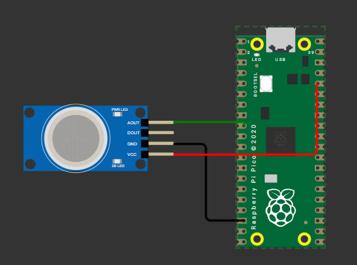

# **IoT-Based Morse Code Transmission System Using Raspberry Pi 4**

## **Morse Code Messaging**

**Name:** Siddharth Karmokar  
**Roll No:** 123CS0061  

---

## **1. Introduction**
This project implements a **Morse code messaging system** using a **touch sensor**, **Blynk**, and **Twilio** on a **Raspberry Pi 4**. The system allows a user to input Morse code using a **touch sensor**, which is then translated into readable text and sent via **Blynk** and **Twilio SMS**. Challenges included accurately detecting touch durations, ensuring proper Morse code decoding, and handling transmission delays. The implementation also required careful GPIO handling for real-time input capture.

---

## **2. Components Used**
- **Raspberry Pi 4**
- **Touch Sensor (Capacitive or Mechanical)**
- **Internet Connectivity (WiFi)**
- **Twilio Account for SMS transmission**
- **Blynk IoT Platform**
- **Power Supply (5V, 2.5A)**

---

## **3. System Architecture**
- The **user inputs Morse code** via a **touch sensor**.
- The Raspberry Pi **decodes** the Morse code into **readable text**.
- The **decoded text is sent** to the **Blynk app** for display.
- The same message is also **forwarded via Twilio** as an SMS to a designated phone number.
- The system ensures **real-time input detection** and **accurate Morse code translation**.

---

## **4. Software and Tools Required**
- **Raspberry Pi OS (Debian-based)**
- **Python 3.9**
- **Blynk Python Library**
- **Twilio API**
- **RPi.GPIO for GPIO Handling**

---

## **5. Morse Code Reference Table**

| Morse Code | Character |
|------------|-----------|
| .-         | A         |
| -...       | B         |
| -.-.       | C         |
| -..        | D         |
| .          | E         |
| ..-.       | F         |
| --.        | G         |
| ....       | H         |
| ..         | I         |
| .---       | J         |
| -.-        | K         |
| .-..       | L         |
| --         | M         |
| -.         | N         |
| ---        | O         |
| .--.       | P         |
| --.-       | Q         |
| .-.        | R         |
| ...        | S         |
| -          | T         |
| ..-        | U         |
| ...-       | V         |
| .--        | W         |
| -..-       | X         |
| -.--       | Y         |
| --..       | Z         |
| -----      | 0         |
| .----      | 1         |
| ..---      | 2         |
| ...--      | 3         |
| ....-      | 4         |
| .....      | 5         |
| -....      | 6         |
| --...      | 7         |
| ---..      | 8         |
| ----.      | 9         |

---

## **5. Circuit Diagram**


---

## **6. Code**
```python
import time
import RPi.GPIO as GPIO
import blynklib
from twilio.rest import Client

# Blynk Auth Token
BLYNK_AUTH = "YOUR_BLYNK_AUTH_TOKEN"
blynk = blynklib.Blynk(BLYNK_AUTH)

# Twilio Credentials
ACCOUNT_SID = "YOUR_TWILIO_SID"
AUTH_TOKEN = "YOUR_TWILIO_AUTH_TOKEN"
TO_NUMBER = "+1234567890"
FROM_NUMBER = "+0987654321"

# Touch Sensor Pin
TOUCH_PIN = 4  # Change to actual GPIO pin
GPIO.setmode(GPIO.BCM)
GPIO.setup(TOUCH_PIN, GPIO.IN, pull_up_down=GPIO.PUD_UP)

# Morse Code Dictionary
MORSE_CODE = {
    ".-": "A", "-...": "B", "-.-.": "C", "-..": "D", ".": "E", "..-.": "F", "--.": "G",
    "....": "H", "..": "I", ".---": "J", "-.-": "K", ".-..": "L", "--": "M", "-.": "N",
    "---": "O", ".--.": "P", "--.-": "Q", ".-.": "R", "...": "S", "-": "T", "..-": "U",
    "...-": "V", ".--": "W", "-..-": "X", "-.--": "Y", "--..": "Z", "-----": "0",
    ".----": "1", "..---": "2", "...--": "3", "....-": "4", ".....": "5", "-....": "6",
    "--...": "7", "---..": "8", "----.": "9"
}

def send_sms(message):
    """Send message using Twilio"""
    client = Client(ACCOUNT_SID, AUTH_TOKEN)
    client.messages.create(to=TO_NUMBER, from_=FROM_NUMBER, body=message)
    print("SMS sent:", message)

def send_to_blynk(message):
    """Send message to Blynk app"""
    blynk.virtual_write(1, message)
    print("Message sent to Blynk:", message)

def read_morse():
    """Reads Morse code input from touch sensor"""
    morse = ""
    message = ""
    last_press_time = None

    while True:
        if GPIO.input(TOUCH_PIN) == GPIO.LOW:
            press_start = time.time()
            while GPIO.input(TOUCH_PIN) == GPIO.LOW:
                pass
            press_duration = time.time() - press_start

            if press_duration < 0.3:
                morse += "."
            else:
                morse += "-"
            last_press_time = time.time()
            print("Current Morse:", morse)
        
        if last_press_time and time.time() - last_press_time > 1.5:
            if morse in MORSE_CODE:
                message += MORSE_CODE[morse]
            morse = ""
            print("Decoded so far:", message)
        
        if time.time() - last_press_time > 3:
            if message:
                send_sms(message)
                send_to_blynk(message)
                message = ""
            last_press_time = None

try:
    print("Touch sensor Morse code input ready...")
    read_morse()
except KeyboardInterrupt:
    GPIO.cleanup()
```